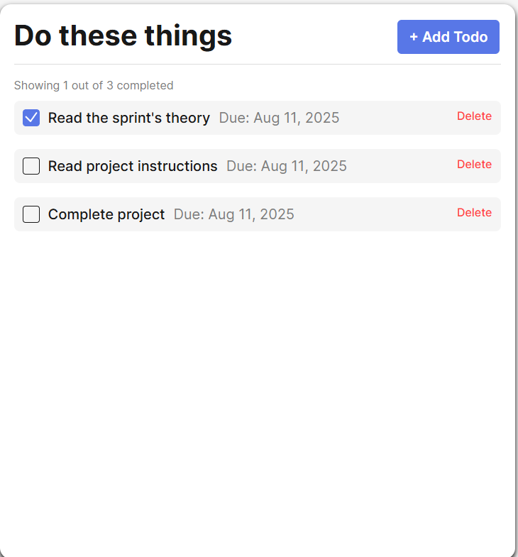
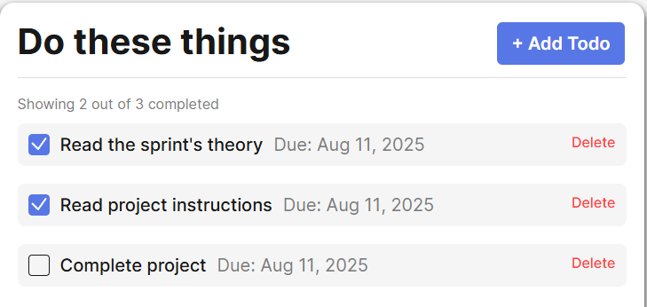
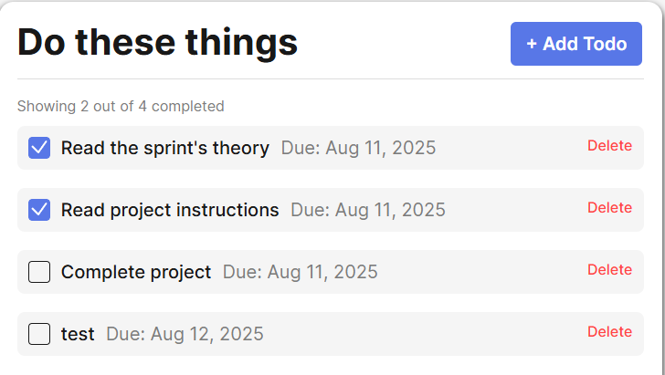

# Simple Todo App

In this simple todo app you are able to manage your todo's for the day by adding items, completing by checking the checkbox or deleting when not needed anymore

## Functionality

- Click the + Add button to add tasks
  - When clicking the add button a form will pop up to add your task and due date
  - Due date does not need to be added to add a task
- Once task is added to the todo list user will click the check box when task is completed
- User is able to delete tasks when completed or not needed by clicking the delete button
- Initial todos are loaded when page is loaded
- 
- Counter is updated when a todo is checked, completed will update with each checked box, it will then decrease if a checkbox is removed
- 
- Using the add todo button will create a popup where a task and date can be entered, once entered the todo will get added to the list and update the number of tasks needed to be completed in the counter
- 

## Technology

- HTML
- CSS
- Javascript

  - Object-Oriented Programming

    - Class Definition:

      - Using the class syntax to define a blueprint (FormValidator) for creating validator object.
      - This encapsulates logic and state related to form validation.

    - Encapsulation:

      - Properties like \_inputSelector, \_formEl, \_buttonElement, etc., are kept as internal state within instances of FormValidator.
      - Methods like \_showInputError, \_toggleButtonState, etc., operate on that internal state.

    - Instantiation:
      - The class is meant to be instantiated with new FormValidator(settings, formEl), creating independent objects with their own state.
    - Abstraction:

      - The user of the class only needs to interact with public methods like enableValidation() and resetValidation().
      - Internal logic is hidden via private methods (prefixed with \_, by convention).

    - Modularity and Reuse:
      - The code is exportable (export default FormValidator) and can be reused across different parts of a larger application.

## Deployment

This project is deployed on GitHub Pages:

- [Justin's Todo App](https://justinpot92.github.io/se_project_todo-app/)
